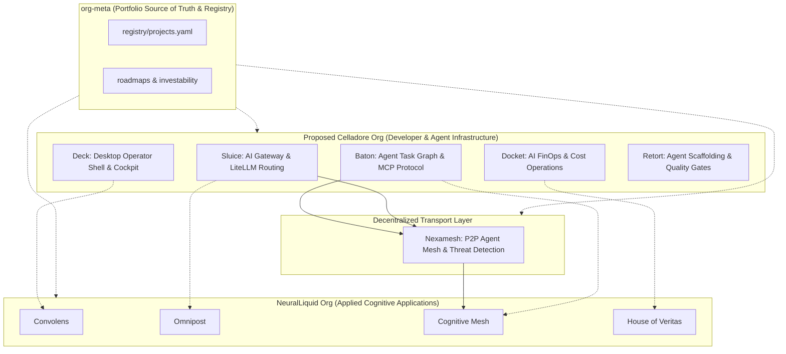

# ADR 0003: Celladore Org Split and Developer Stack Separation

## Status

Proposed / Under Exploration

## Context

The portfolio architecture defined in [`org-meta`](file:///C:/Users/smitj/repos/org-meta/README.md) (the authoritative intelligence and governance layer for the entire organization portfolio) categorizes systems across four architectural layers:

* **Layer 1 — Intelligence & Governance**: `org-meta`, `mcp-org`, `baton`
* **Layer 2 — AI Infrastructure**: `sluice`, `docket`, `cognitive-mesh`, `retort`
* **Layer 3 — Developer & Ops Tooling**: `deck`, `codeflow-plugins`
* **Layer 4 — Infrastructure**: `azure-infrastructure`, `azure-project-template`, `phoenix-runner`

Within this portfolio taxonomy, projects naturally divide into two distinct strategic directions:

1. **Applied Cognitive Applications & Vertical AI Products** (`neuralliquid`):
   - `convolens` (AI Observability & Contextual Intelligence)
   - `omnipost` (Omnichannel Content Distribution & Social Engine)
   - `cognitive-mesh` (Autonomous Multi-Agent Coordination Framework, relaunching as `neuralliquid.ai`)
   - `house-of-veritas` (Data Provenance, Truth, and Verification)
   - `nexamesh` / `nexamesh-core` (Decentralized mesh transport layer & IoT intelligence, brand `nexamesh.ai`)

2. **Agentic Runtime, Developer Tooling & Workflow Primitives** (Proposed `celladore`):
   - `sluice` (OpenAI-compatible AI gateway on Azure Container Apps with LiteLLM routing; currently `phoenixvc/sluice`)
   - `docket` (AI cost operations, LLM spend tracking, and FOCUS billing exports; currently `phoenixvc/docket`)
   - `baton` (Human + agent shared task graph, React Kanban UI, MCP server, lease orchestration; currently `phoenixvc/baton`)
   - `deck` (Desktop developer & ops control plane in Tauri; currently `phoenixvc/deck`)
   - `retort` (Windows-first polyglot AI-orchestration framework & agent teams; currently `phoenixvc/retort`)

### Motivations for Organizational Separation

- **Alignment with `org-meta` Layer Definitions**:
  - `neuralliquid` focuses on consumer/enterprise vertical solutions.
  - `celladore` unifies Layer 1/2/3 developer primitives into an integrated, developer-first platform.
- **Different User Personas & Value Propositions**:
  - `neuralliquid` serves end-users, enterprises, and domain verticals needing finished cognitive solutions and intelligence products.
  - `celladore` serves AI developers, agent builders, and systems engineers seeking modular, open-source or developer-first primitives for building multi-agent systems.
- **Independent Governance & Funding Tracks**:
  - Developer platforms (Celladore stack) qualify for open-source developer grants (e.g., GitHub Accelerator, YC Developer Tracks, AWS GenAI Accelerator, NVIDIA Inception).
  - Enterprise/Vertical AI applications (NeuralLiquid) target enterprise VC funds (Partech, TLcom, Knife Capital, Microsoft ATO co-sell, Azure Marketplace).
- **Decoupled Release Cycles & Control Planes**:
  - Celladore tools require high-velocity developer feedback, lightweight package/SDK publishing (NPM, PyPI, Crates.io), and standalone CI/CD workflows.
  - NeuralLiquid requires domain DNS governance (`neuralliquid.ai`), enterprise SLA compliance, and multi-tenant data boundary isolation.

## Decision

Explore and prepare the migration of the **Sluice / Docket / Baton / Deck / Retort** developer stack from `phoenixvc` into a dedicated GitHub organization and control plane: `celladore`.

### Boundaries & Cross-Org Architecture

### Operational Guidelines During Exploration

1. **Portfolio Synchronization**: Maintain parity with `org-meta/registry/projects.yaml` as the canonical portfolio registry. Exploration entries in `products/*.yaml` should link directly to their corresponding `org-meta` record.
2. **Infrastructure Isolation**: Ensure no Celladore runtime infrastructure becomes tightly coupled with `neuralliquid-org` shared Terraform state (e.g., separate Key Vaults, resource groups, and DNS namespaces like `celladore.ai` or `celladore.dev`).
3. **Cross-Org Communication**: Use standard protocol contracts (e.g., OpenAPI, gRPC, MCP tools) for any interaction between NeuralLiquid products and Celladore tools.

## Consequences

### Positive
- Crisp separation of concerns between developer infrastructure and consumer/enterprise products.
- Tailored branding, marketing, and community positioning for both ecosystems.
- Dual-track fundraising and grant eligibility (developer tool grants vs enterprise application venture capital).
- Aligns clean ownership boundaries with `org-meta` portfolio governance.

### Negative / Trade-offs
- Additional organizational overhead (managing two GitHub orgs, separate DNS zones, and independent CI/CD standards).
- Requires clear API and package release versioning between Celladore components and NeuralLiquid consumers.
