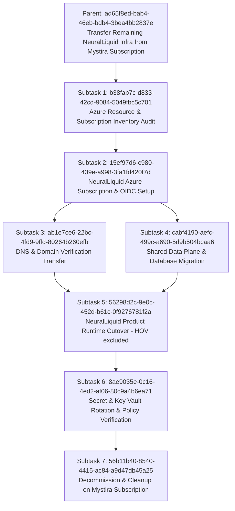

# NeuralLiquid Azure Subscription Migration Plan

**Status:** Task Created in Baton (`ad65f8ed-bab4-46eb-bdb4-3bea4bb2837e`)  
**Priority:** Critical  
**Goal:** Migrate and isolate all remaining NeuralLiquid cloud infrastructure from the shared/legacy Mystira Azure subscription (`mystira-sub`) to a dedicated, sovereign NeuralLiquid Azure subscription (`neuralliquid-sub`).

> **Scope amendment — 2026-08-21:** House of Veritas is no longer a
> `neuralliquid-sub` destination. [ADR 0004](../adr/0004-hov-nexamesh-product-boundary.md)
> classifies HOV as a NexaMesh product, and the
> [HOV migration addendum](./hov-nexamesh-migration-addendum.md) targets an
> isolated HOV boundary in `nexamesh-sub`. HOV remains in source inventory and
> retirement checks because its current runtime and database dependencies still
> touch this migration's source infrastructure.

---

## Strategic Context

NeuralLiquid workloads (*Convolens, Omnipost, Cognitive Mesh, and shared PostgreSQL/Key Vault resources*) must not share an Azure subscription with Mystira/Eben's infrastructure. HOV has the same source-isolation requirement but follows the separate NexaMesh target plan linked above:
1. **Legal & Ownership Isolation**: Clean IP, cost attribution, and SOC2/ISO compliance boundaries.
2. **Billing & Budget Governance**: Eliminates cross-charging and unlocks direct Azure startup credits via Microsoft Founders Hub without affecting Mystira spend.
3. **Security & Blast Radius**: Eliminates shared Service Principals, Key Vaults, and IAM admin sprawl.

---

## Subtask Taskgraph Architecture



---

## Detailed Phase Execution Breakdown

### Subtask 1: Azure Resource & Subscription Inventory Audit (`b38fab7c-d833-42cd-9084-5049fbc5c701`)
* **Objective**: Enumerate all NeuralLiquid resources currently on `mystira-sub`.
* **Scope**:
  - `convolens`: App Service (`nl-prod-convolens-web`), App Service Plan, Key Vault (`nl-prod-convolens-kv`), legacy PG (`nl-prod-convolens-pg`).
  - `house-of-veritas`: source-only inventory of App Service (`nl-prod-hov-app`), Functions, Key Vault (`nl-prod-hov-kv`), and shared dependencies; target execution belongs to the HOV/NexaMesh addendum.
  - `cognitive-mesh`: Container Apps (`cog-dev-rg-san` CAE, `cognitive-mesh-api`), App Service (`cognitive-mesh-frontend-prod`).
  - `shared-data`: PostgreSQL server (`nl-prod-shared-pg`), Key Vault (`nl-prod-shared-kv`), Resource Group (`nl-prod-shared-rg`).
  - `dns`: `neuralliquid.ai` domain validation TXT records (`asuid.*`).

### Subtask 2: NeuralLiquid Azure Subscription & OIDC Federation Setup (`15ef97d6-c980-439e-a998-3fa1fd420f7d`)
* **Objective**: Establish the sovereign target subscription.
* **Scope**:
  - Provision / designate `neuralliquid-sub`.
  - Configure subscription-level RBAC and budget alert thresholds ($500, $1k, $2.5k).
  - Configure GitHub Actions OIDC federated credentials for `neuralliquid/neuralliquid-org` and product repos.
  - Setup remote Terraform state storage account (`nlprodorgstate`).

### Subtask 3: DNS & Custom Domain Validation Transfer (`ab1e7ce6-22bc-4fd9-9ffd-80264b260efb`)
* **Objective**: Decouple domain validation tokens.
* **Scope**:
  - Retrieve target verification IDs from new App Services / Container Apps.
  - Update `infra/terraform/dns/main.tf` to point TXT `asuid.*` records to the new subscription resources.
  - Apply DNS updates via `neuralliquid-org` Terraform pipeline.

#### Execution log, 2026-08-19

Scope grew beyond the original description above: the `neuralliquid-org`
Terraform pipeline for this stack cannot run at all — its `backend.tf` still
targets remote state storage (`nlorgtfstate`) in the legacy, inaccessible
subscription, so this was executed via `az` CLI directly instead (matching
how `neuralliquid-web-prod` was provisioned earlier in this same migration),
with Terraform updated in parallel (`infra/terraform/dns/{main,imports,variables}.tf`)
so a future `terraform apply` adopts these records instead of erroring once
the state-backend bootstrap (Subtask 2) unblocks this stack.

What was done:
- Every live record in the old zone was captured by direct DNS query — not
  copied from Terraform or `docs/inventory/dns.md`, both of which had drifted
  (see `docs/inventory/dns.md` for the Omnipost and `login.hov` corrections
  this surfaced).
- A new `neuralliquid.ai` zone was created in `neuralliquid-sub`
  (resource group `nl-global-shared-rg`), with all 21 record sets recreated:
  the 7 product CNAMEs + 7 `asuid.*` TXT validations, apex `@` A/MX/TXT, and
  `www`/`email` CNAMEs (the last five previously unmanaged by any Terraform).
- Every record was re-verified by querying the new zone's own nameservers
  directly, not just trusted from the `az` response.
- The old zone (`mys-global-shared-rg`, subscription
  `bb4e3882-2079-4bab-8974-611bc0b8bb58`) is untouched and still authoritative
  — nothing here has gone live yet.

**What's still pending — the NS delegation cutover.** This is a registrar
action at Dynadot (the domain's registrar, confirmed via RDAP) and requires
the domain owner's login; it cannot be executed from this session. When ready,
replace the domain's nameservers with:

```
ns1-02.azure-dns.com
ns2-02.azure-dns.net
ns3-02.azure-dns.org
ns4-02.azure-dns.info
```

At Dynadot: **My Domains → neuralliquid.ai → Nameservers**, switch off the
default/parked nameservers to "Custom," and enter the four values above.
Propagation is typically minutes to a few hours; DNS caches elsewhere can take
up to 24-48h to fully clear. `client transfer prohibited` (the standard
registrar lock shown in RDAP) does not block this — it only blocks domain
*transfers*, not nameserver edits. No DNSSEC is active on the domain
(`secureDNS.delegationSigned: false` in RDAP), so there's no DS-record
coordination needed either.

After the flip, verify all five hostnames plus mail before considering this
subtask closed — `nslookup <host> ns1-02.azure-dns.com` against the new zone
directly is how every record above was already validated once; the same
checks against the public resolvers after cutover close the loop.

#### Decision update, 2026-08-19 (later same day) — target changed to Cloudflare

**The Azure-DNS cutover above is paused, not executed.** User decision: the
domain should not delegate to Azure DNS at all — the whole reason this
migration exists is that the *old* zone got orphaned when a subscription
became inaccessible, and pointing the registrar at Azure DNS again (even a
subscription this org currently controls) keeps that same failure mode live.
Delegating to Cloudflare instead decouples `neuralliquid.ai`'s DNS from any
Azure subscription entirely, so a repeat of today's root cause becomes
structurally impossible, not just currently-not-happening.

**What this changes:**
- The registrar cutover target is Cloudflare's nameservers, not the four
  `azure-dns.*` values above. Those values are no longer the plan — do not
  use them.
- The `neuralliquid-sub` zone built and verified earlier today
  (`nl-global-shared-rg`) is **not wasted** — it's the authoritative,
  live-verified source of truth for all 21 records, now being copied to
  Cloudflare instead of becoming the delegation target itself. Keep it in
  place as a secondary reference/rollback source until Cloudflare is live
  and confirmed stable, then it's a decommission candidate (Subtask 7-style
  cleanup, not urgent).
- PR #7 (`neuralliquid-org`, `azurerm_dns_*` Terraform + import blocks) is
  **on hold, not merged** — it's still correct as a record of the verified
  Azure zone, but merging it implies Azure DNS is the ongoing IaC target,
  which is no longer the plan. Revisit once the Cloudflare stack exists:
  either merge as-is (Azure zone kept as documented rollback infra) or close
  once Cloudflare is confirmed live and the Azure zone is torn down.

**What's needed next (blocking, user-only — account creation and API tokens
are both outside what an agent should do on someone's behalf):**
1. Create/sign into a Cloudflare account and add `neuralliquid.ai` as a site.
   Skip Cloudflare's automatic DNS scan/import — it would scan whatever's
   *currently* authoritative (the old, drift-prone Dynadot-default zone),
   not the clean 21-record set already captured in this repo. Records should
   be entered from `infra/terraform/dns/main.tf` / this document instead.
2. Generate a scoped Cloudflare API token (Zone:DNS:Edit, scoped to just this
   zone) for Terraform to use, once a `cloudflare`-provider stack exists.
3. Cloudflare's proxy ("orange cloud") must stay **off (DNS only, grey
   cloud)** for every one of these records — the Static Web App and
   Container App hosts rely on direct DNS resolution for
   `dns-txt-token`/`cname-delegation` validation and Azure-managed TLS;
   proxying breaks that validation silently. MX/SPF/apex TXT can't be
   proxied by Cloudflare anyway (not supported for those types), so no
   action needed there — just don't accidentally enable it on the A/CNAME
   records.

Once the Cloudflare zone exists with a token available, the next steps are:
write a `cloudflare`-provider Terraform stack seeded from the same 21-record
set, apply it, then do the single Dynadot NS flip straight to Cloudflare
(skipping Azure DNS as an intermediate hop entirely).

#### Cloudflare zone built and verified, 2026-08-19 (later still, same day)

The Cloudflare zone was populated via BIND zone-file import (all 22
individual records — Azure's 21 record-sets, with the 2-value MX and
3-value apex TXT set expanding to individual rows in Cloudflare's flat
model) and every record was re-verified directly against **both** of
Cloudflare's assigned nameservers for this zone
(`jack.ns.cloudflare.com`, `laylah.ns.cloudflare.com`) — same rigor as the
Azure zone, all values matching `infra/terraform/dns/main.tf` exactly.
Every A/CNAME record confirmed **DNS only** (not proxied) as required for
Azure's domain validation and managed-TLS renewal — see the proxy warning
above; declined Cloudflare's onboarding suggestion to proxy any record for
DDoS/CDN benefits, since all origins are Azure PaaS services where that
carries real renewal risk for marginal benefit right now.

**This supersedes the `azure-dns.*` nameservers earlier in this section.**
The actual cutover target is:

```
jack.ns.cloudflare.com
laylah.ns.cloudflare.com
```

At Dynadot: **My Domains → neuralliquid.ai → Nameservers**, switch to
"Custom," and enter the two values above (replacing whatever's there now —
do not add the Azure values, they were never delegated to). Same caveats as
before still apply: `client transfer prohibited` doesn't block this (NS
edits aren't transfers), and there's no DNSSEC to coordinate
(`secureDNS.delegationSigned: false`). This is still a registrar action
only the domain owner can perform.

After the flip, verify all nine hostnames (7 product + apex + www) plus
mail before considering Subtask 3 closed, same method as always —
`nslookup <host> jack.ns.cloudflare.com` directly, then the same checks
against public resolvers once propagation clears.

#### Subtask 3 closed, 2026-08-19 (cutover complete)

The Dynadot nameserver change was made but not initially saved (form was
filled in, "Save Name Server" hadn't been clicked) — the `.ai` registry
still showed the prior delegation (`ns*-08.azure-dns.*`, the legacy zone's
real nameservers — a third, previously-unrecorded Azure zone, distinct
from the `-02` zone built earlier today) when queried directly. After
actually saving, a direct query against the `.ai` registry
(`v0n0.nic.ai`) confirmed `jack`/`laylah.ns.cloudflare.com` within
minutes, and both Google's and Cloudflare's public resolvers had already
picked it up on the next check — no multi-hour wait needed this time.

Full end-to-end verification against a public resolver (8.8.8.8) after
cutover: apex A, apex MX (both), and all 9 hostnames (7 product + apex +
www) resolve through to their correct real targets. `email` CNAME
resolves correctly too. `curl -I https://neuralliquid.ai` and
`https://www.neuralliquid.ai` both return `200 OK` with valid TLS —
confirming the Static Web App's custom-domain binding (`dns-txt-token`
apex, `cname-delegation` www) survived the DNS host change without
re-validation issues, which was an open question until now.

**neuralliquid.ai is now fully live on Cloudflare DNS.** Both Azure zones
(the legacy one at `ns*-08.azure-dns.*` and the `neuralliquid-sub` one
built earlier today at `ns*-02.azure-dns.*`) are orphaned but intentionally
left in place as rollback references — decommissioning either is a
follow-up, not urgent, and out of scope for this subtask.

**Not yet done, still open:** DKIM/DMARC records for Mailgun (pre-existing
gap, documented in `docs/inventory/dns.md`, not part of this migration's
scope); a `cloudflare`-provider Terraform stack (all of today's Cloudflare
work was done via zone-file import + dashboard, not IaC) — the current
Azure Terraform in PR #7 is being kept/merged as the verified
source-of-truth record set and rollback documentation, not as the live
management path.

### Subtask 4: Shared Data Plane & Database Migration (`cabf4190-aefc-499c-a690-5d9b504bcaa6`)
* **Objective**: Reconstitute `nl-prod-shared-pg` and Key Vaults.
* **Scope**:
  - Deploy `infra/terraform/shared-data` to `neuralliquid-sub` (`5a95ddee-dd63-441a-8306-c8b0803dcdd4`) for `nl-prod-shared-pg` and `nl-prod-shared-rg` in `southafricanorth`.
  - Strictly enforce HOV exclusion policy (ADR 0004 & task 37547ca3): HOV is excluded from the NeuralLiquid shared data plane; its database on `mystira-sub` remains untouched until the separately approved HOV/NexaMesh migration.
  - Execute database dumps and restores only for approved NeuralLiquid tenant schemas (`convolens`). See [Convolens Database Migration Runbook](../runbooks/convolens-database-migration.md).
  - Configure Key Vault `nl-prod-shared-kv` with new admin credentials.


### Subtask 5: Product Runtime Services Cutover (`56298d2c-9e0c-452d-b61c-0f9276781f2a`)
* **Objective**: Deploy and cutover product runtimes.
* **Scope**:
  - Deploy Convolens web app and bind TLS certificate.
  - House of Veritas is excluded; its Next.js and worker runtime follows the separately gated HOV/NexaMesh migration addendum. Execution remains unauthorized by this plan.
  - Deploy Omnipost App Service (`nl-prod-omnipost-web`).
  - Deploy Cognitive Mesh Next.js frontend + CAE.
  - Perform synthetic health probes across the three NeuralLiquid product subdomains. Monitor the existing HOV compatibility endpoint separately without changing it.

### Subtask 6: Secret & Key Vault Rotation & Access Policy Verification (`8ae9035e-0c16-4ed2-af06-80c9a4b6ea71`)
* **Objective**: Complete cryptographic and credential isolation.
* **Scope**:
  - Rotate database user passwords, JWT secrets, and API keys.
  - Enforce Azure Managed Identity (SystemAssigned) Key Vault role assignments (`Key Vault Secrets User`).
  - Verify zero read grants or secrets reference old Mystira Key Vaults.

### Subtask 7: Decommission & Cleanup on Mystira Subscription (`56b11b40-8540-4415-ac84-a9d47db45a25`)
* **Objective**: Safe deprecation and cost elimination on source subscription.
* **Scope**:
  - Confirm 24-48 hours of healthy production traffic on `neuralliquid-sub`.
  - Revoke connection permissions only for migrated NeuralLiquid tenants. Preserve every HOV database permission and shared dependency until the HOV addendum's Phase 6 observation and retirement gate is accepted by both HOV and NeuralLiquid owners.
  - Delete only enumerated, retired NeuralLiquid resource groups on `mystira-sub` (`nl-prod-convolens-pg`, legacy RGs); exclude HOV resources and any shared resource it still uses.

---

## Related Documents & Decisions

* [ADR 0001: Control Plane and Product Repo Boundaries](../adr/0001-control-plane-boundaries.md)
* [ADR 0002: Shared Data Plane Ownership](../adr/0002-shared-data-plane-ownership.md)
* [Terraform Control Plane Phases](terraform-control-plane-phases.md)
* [Funding & Ecosystem Strategy](funding-strategy-and-ecosystem-programs.md)
