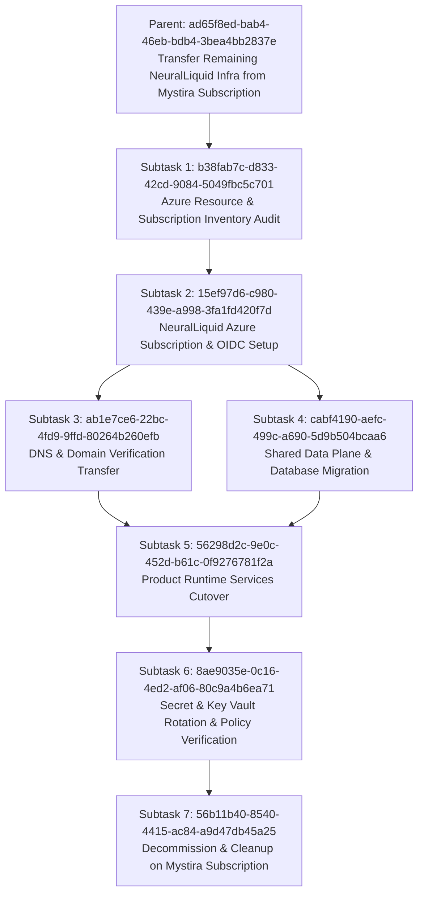

# NeuralLiquid Azure Subscription Migration Plan

**Status:** Task Created in Baton (`ad65f8ed-bab4-46eb-bdb4-3bea4bb2837e`)  
**Priority:** Critical  
**Goal:** Migrate and isolate all remaining NeuralLiquid cloud infrastructure from the shared/legacy Mystira Azure subscription (`mystira-sub`) to a dedicated, sovereign NeuralLiquid Azure subscription (`neuralliquid-sub`).

---

## Strategic Context

NeuralLiquid workloads (*Convolens, Omnipost, Cognitive Mesh, House of Veritas, and shared PostgreSQL/Key Vault resources*) must not share an Azure subscription with Mystira/Eben's infrastructure:
1. **Legal & Ownership Isolation**: Clean IP, cost attribution, and SOC2/ISO compliance boundaries.
2. **Billing & Budget Governance**: Eliminates cross-charging and unlocks direct Azure startup credits via Microsoft Founders Hub without affecting Mystira spend.
3. **Security & Blast Radius**: Eliminates shared Service Principals, Key Vaults, and IAM admin sprawl.

---

## Subtask Taskgraph Architecture

---

## Detailed Phase Execution Breakdown

### Subtask 1: Azure Resource & Subscription Inventory Audit (`b38fab7c-d833-42cd-9084-5049fbc5c701`)
* **Objective**: Enumerate all NeuralLiquid resources currently on `mystira-sub`.
* **Scope**:
  - `convolens`: App Service (`nl-prod-convolens-web`), App Service Plan, Key Vault (`nl-prod-convolens-kv`), legacy PG (`nl-prod-convolens-pg`).
  - `house-of-veritas`: App Service (`nl-prod-hov-app`), Functions, Key Vault (`nl-prod-hov-kv`).
  - `cognitive-mesh`: Container Apps (`cog-dev-rg-san` CAE, `cognitive-mesh-api`), App Service (`cognitive-mesh-frontend-prod`).
  - `shared-data`: PostgreSQL server (`nl-prod-shared-pg`), Key Vault (`nl-prod-shared-kv`), Resource Group (`nl-prod-shared-rg`).
  - `dns`: `neuralliquid.ai` domain validation TXT records (`asuid.*`).

### Subtask 2: NeuralLiquid Azure Subscription & OIDC Federation Setup (`15ef97d6-c980-439e-a998-3fa1fd420f7d`)
* **Objective**: Establish the sovereign target subscription.
* **Scope**:
  - Provision / designate `neuralliquid-sub`.
  - Configure subscription-level RBAC and budget alert thresholds ($500, $1k, $2.5k).
  - Configure GitHub Actions OIDC federated credentials for `neuralliquid/neuralliquid-org` and product repos.
  - Setup remote Terraform state storage account (`nlprodorgstate`).

### Subtask 3: DNS & Custom Domain Validation Transfer (`ab1e7ce6-22bc-4fd9-9ffd-80264b260efb`)
* **Objective**: Decouple domain validation tokens.
* **Scope**:
  - Retrieve target verification IDs from new App Services / Container Apps.
  - Update `infra/terraform/dns/main.tf` to point TXT `asuid.*` records to the new subscription resources.
  - Apply DNS updates via `neuralliquid-org` Terraform pipeline.

### Subtask 4: Shared Data Plane & Database Migration (`cabf4190-aefc-499c-a690-5d9b504bcaa6`)
* **Objective**: Reconstitute `nl-prod-shared-pg` and Key Vaults.
* **Scope**:
  - Deploy `infra/terraform/shared-data` to `neuralliquid-sub`.
  - Execute database dumps and restores for tenant schemas (`convolens_prod`, `hov_prod`).
  - Configure Key Vault `nl-prod-shared-kv` with new admin credentials.

### Subtask 5: Product Runtime Services Cutover (`56298d2c-9e0c-452d-b61c-0f9276781f2a`)
* **Objective**: Deploy and cutover product runtimes.
* **Scope**:
  - Deploy Convolens web app and bind TLS certificate.
  - Deploy House of Veritas Next.js + Python Function App.
  - Deploy Omnipost App Service (`nl-prod-omnipost-web`).
  - Deploy Cognitive Mesh Next.js frontend + CAE.
  - Perform synthetic health probes across all 4 production subdomains.

### Subtask 6: Secret & Key Vault Rotation & Access Policy Verification (`8ae9035e-0c16-4ed2-af06-80c9a4b6ea71`)
* **Objective**: Complete cryptographic and credential isolation.
* **Scope**:
  - Rotate database user passwords, JWT secrets, and API keys.
  - Enforce Azure Managed Identity (SystemAssigned) Key Vault role assignments (`Key Vault Secrets User`).
  - Verify zero read grants or secrets reference old Mystira Key Vaults.

### Subtask 7: Decommission & Cleanup on Mystira Subscription (`56b11b40-8540-4415-ac84-a9d47db45a25`)
* **Objective**: Safe deprecation and cost elimination on source subscription.
* **Scope**:
  - Confirm 24-48 hours of healthy production traffic on `neuralliquid-sub`.
  - Revoke connection permissions on legacy PostgreSQL instances.
  - Delete retired resource groups on `mystira-sub` (`nl-prod-convolens-pg`, legacy RGs).

---

## Related Documents & Decisions

* [ADR 0001: Control Plane and Product Repo Boundaries](../adr/0001-control-plane-boundaries.md)
* [ADR 0002: Shared Data Plane Ownership](../adr/0002-shared-data-plane-ownership.md)
* [Terraform Control Plane Phases](terraform-control-plane-phases.md)
* [Funding & Ecosystem Strategy](funding-strategy-and-ecosystem-programs.md)
