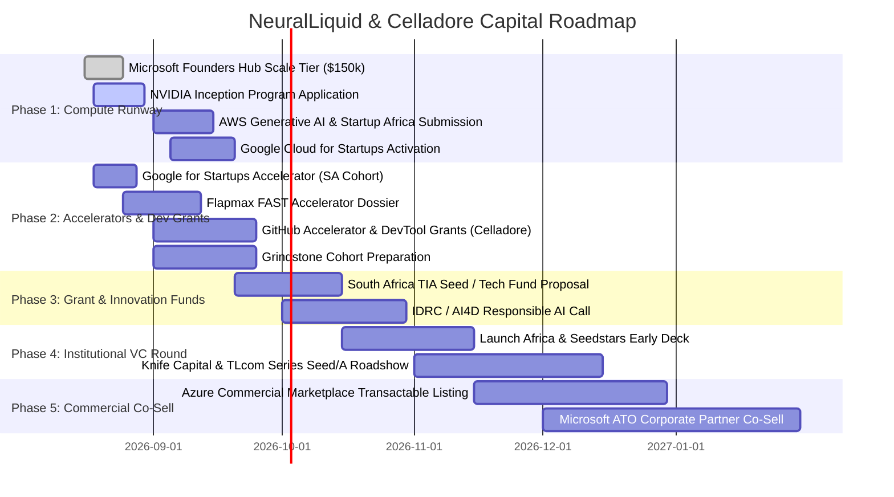

# NeuralLiquid & Celladore Ecosystem Capital Strategy

Comprehensive guide to funding avenues, AI GPU infrastructure programs, venture capital funds, accelerators, and enterprise co-selling tracks across African and global technology ecosystems.

---

## Executive Summary

The artificial intelligence and cloud software landscape across emerging markets and developer infrastructure is experiencing unprecedented institutional backing. Over **$1.5B+** in dedicated venture capital, non-dilutive grants, sovereign GPU infrastructure, and tech-giant compute subsidies are actively deployed:

1. **Big Tech Cloud & AI Infrastructure**:
   - **Microsoft Africa Transformation Office (ATO)**: 5-year 10,000-startup initiative with a **$500M VC partner network** and the **Founders Hub** ($150k Azure + OpenAI API credits).
   - **NVIDIA Inception & Cassava Technologies**: $720M African AI Factory deploying high-performance GPU nodes (GPUaaS) across South Africa, Kenya, Nigeria, and Egypt.
   - **AWS Generative AI Accelerator & Startup Africa**: Up to $1M in compute credits, Amazon Bedrock access, and dedicated AI architecture mentoring.
   - **Google Africa Ecosystem**: $50M Africa Investment Fund and the Google for Startups Accelerator (up to R1M non-dilutive grant + Gemini AI models).
2. **Specialized AI & Scale-up Accelerators**:
   - **Flapmax FAST Accelerator** (Microsoft AI & sustainability partner, Silicon Valley immersion).
   - **Grindstone Accelerator** (Knife Capital's scaleup readiness program).
   - **Accelerate Africa** (Pan-African founder accelerator for $250k–$500k seed readiness).
   - **Norrsken Impact Accelerator** ($125k investment sprint and global investor network).
3. **Leading Pan-African & DeepTech VC Funds**:
   - **Partech Africa II** ($300M+ fund), **TLcom Capital TIDE Africa II** ($154M fund), **Knife Capital K3 Fund**, **Launch Africa Ventures**, **Global Ventures**, and **Seedstars Africa Ventures**.
4. **Dual-Organization Architecture & Portfolio Governance**:
   - **NeuralLiquid**: Applied AI & cognitive solutions (*Convolens, Omnipost, Cognitive Mesh, House of Veritas, Nexamesh*).
   - **Celladore**: Developer platform, agent task protocol, and event runtime stack (*Sluice, Docket, Baton, Deck, Retort, Celladore-Org*).
   - **Governance & Registry of Record**: Anchored in [`org-meta`](../../org-meta/README.md) with verified 2026-08 investability scores and two-axis tracking (Investability vs Realised utility).

---

## Verified Portfolio Investability & Readiness Matrix

*Source: [`org-meta/docs/investability-rescore-2026-08.md`](../../org-meta/docs/investability-rescore-2026-08.md) and [`org-meta/registry/projects.yaml`](../../org-meta/registry/projects.yaml)*

| Product | Org | C% | Mkt | Moat | Ext | Int | **Index** | **Realised** | Tier | Status & Primary Roadmap Gate |
| :--- | :--- | :---:| :---:| :---:| :---:| :---:| :---:| :---:| :---:| :--- |
| **sluice** | `celladore` | 80% | 8 (L) | 5 | 6 | 9 | **6.9** | **7.3** | **T1** | Live on ACA; OTEL cost streaming pipeline to Docket |
| **cognitive-mesh** | `neuralliquid` | 60% | 8 (L) | 7 | 8 | 3 | **7.0** | 4.5 | **T2** | HTTP API live; Next.js frontend DNS deploy to `neuralliquid.ai` |
| **nexamesh** | `nexamesh` | 60% | 6 (M) | 7 | 7 | 2 | **6.1** | 3.6 | **T2** | 294 diligence docs; Docusaurus deploy & docs DNS fix |
| **baton** | `celladore` | 70% | 6 (M) | 6 | 5 | 7 | **6.0** | **6.4** | **T2** | MCP agent lease endpoints live; bidirectional YAML sync |
| **celladore-org** | `celladore` | 10% | 8 (L) | 6 | 6 | 8 | **6.2** | 2.5 | **T2** | Org bootstrap, DNS setup (`celladore.ai`), package repo standards |
| **veritasvault** | `neuralliquid` | 60% | 6 (M) | 6 | 6 | 5 | **5.9** | 4.5 | **T3** | Active development; .NET + Web consolidation |
| **convolens** | `neuralliquid` | 65% | 6 (M) | 5 | 6 | 6 | **5.8** | **5.8** | **T3** | Live custom domain & TLS; WhatsApp quote commercial pilot |
| **omnipost** | `neuralliquid` | 40% | 8 (L) | 3 | 5 | 2 | **4.8** | 2.6 | **T4** | App Service deployment; replace broken root domain CNAME |
| **docket** | `celladore` | 60% | 6 (M) | 2 | 4 | 4 | **4.3** | 4.6 | **T3** | Deployed `/health` 200; Azure billing blob ingestion |
| **house-of-veritas** | `neuralliquid` | 50% | 6 (M) | 3 | 3 | 5 | **4.3** | 4.6 | **T4** | Shared Postgres migration; Sluice gateway wiring verified |
| **deck** | `celladore` | 10% | 4 (S) | 4 | 4 | 7 | **3.9** | 2.6 | **T4** | Tauri shell with Service Manager (Sluice/Docket/Baton) |

---

## Ecosystem Opportunity Architecture

```mermaid
flowchart TD
    NL[NeuralLiquid & Celladore Stack] --> P1[Tier 1: Cloud & GPU Compute Subsidies]
    NL --> P2[Tier 2: Accelerators & DevTool Studios]
    NL --> P3[Tier 3: Institutional Venture Capital]
    NL --> P4[Tier 4: Non-Dilutive AI & Open Source Grants]
    NL --> P5[Tier 5: Enterprise Co-Selling & Sovereign AI]

    P1 --> MSFH[Microsoft Founders Hub\nUp to $150k Azure + OpenAI API]
    P1 --> NV[NVIDIA Inception\nGPUaaS & Preferred Hardware]
    P1 --> AWS[AWS Generative AI Accelerator\nUp to $1M Compute / Bedrock]
    P1 --> GCP[Google for Startups Cloud\nUp to $200k Google Cloud + Gemini]

    P2 --> FAST[Flapmax FAST Accelerator\nMicrosoft AI DeepTech Track]
    P2 --> GS[Grindstone Accelerator\nB2B Scaleup & Knife Capital Pipeline]
    P2 --> GFSA[Google for Startups Accelerator\nEquity-Free R1M & Technical Mentorship]
    P2 --> GHA[GitHub Accelerator & Open Source\nDeveloper Tooling Tracks]
    P2 --> NS[Norrsken Impact Accelerator\n$125k Pre-Seed + Global Showcase]

    P3 --> PT[Partech Africa II\n$300M+ Seed to Series B Fund]
    P3 --> TL[TLcom TIDE Africa II\n$154M Seed to Series A Fund]
    P3 --> KC[Knife Capital K3\nB2B SaaS & Enterprise AI Lead]
    P3 --> LA[Launch Africa Ventures\nActive Seed/Early AI Investor]
    P3 --> GV[Global Ventures & Banque Misr\nMS ATO VC Partner Network]
    P3 --> GAIF[Google Africa Investment Fund\n$50M Direct Equity Vehicle]

    P4 --> GATES[Gates Foundation AI Grand Challenges\nEquitable AI & Multi-lingual Models]
    P4 --> AI4D[IDRC / AI4D Africa Grants\nResponsible AI & Policy Frameworks]
    P4 --> TIA[TIA / DSTI South Africa\nSeed & Technology Development Grants]

    P5 --> ATO[Microsoft ATO Co-Sell & Azure Marketplace\nMACC Enterprise Drawdown]
    P5 --> CAS[Cassava / NVIDIA AI Factory\nLocal Sovereign AI Datacenter Access]
```



---

## 1. Cloud & AI GPU Infrastructure Programs

| Program | Value & Perks | Focus & Model Access | Target Applications |
| :--- | :--- | :--- | :--- |
| **Microsoft for Startups Founders Hub** | • Up to **$150,000** Azure credits<br>• GitHub Enterprise (20 seats)<br>• Microsoft 365, Visual Studio, LinkedIn Premium | Azure OpenAI (GPT-4o, Embeddings), Microsoft Fabric | Baseline cloud runway across all NeuralLiquid & Celladore products |
| **NVIDIA Inception Program** | • Free, equity-free membership<br>• Preferred hardware pricing & GPUaaS credits<br>• NVIDIA Deep Learning Institute (DLI) training<br>• Direct investor introductions | CUDA, TensorRT, NeMo, Local Sovereign GPU compute | **Cognitive Mesh** & **Nexamesh** neural routing |
| **AWS Generative AI Accelerator & Startup Africa** | • Up to **$1,000,000** in AWS promotional credits<br>• Hands-on AWS AI Solutions Architecture<br>• Global demo day & VC network access | Amazon Bedrock, Anthropic Claude, Trainium/Inferentia chips | **Sluice** event streaming & multi-agent backends |
| **Google for Startups Cloud Program** | • Up to **$100,000 - $200,000** GCP credits over 2 years<br>• Google Workspace credits<br>• Web3 / AI specialized tracks | Gemini 1.5 Pro/Flash, Vertex AI, Google Search Grounding | High-throughput API workloads & indexing |

---

## 2. Accelerators & Venture Studios

### A. Flapmax FAST Accelerator (Microsoft Partnered)
* **Focus**: High-growth AI, sustainability, and deep-tech ventures operating in Africa.
* **Benefits**: Virtual bootcamps, joint Microsoft AI engineering support, and an in-person Silicon Valley immersion sprint with global VCs.
* **Fit**: **Cognitive Mesh**, **Convolens**, and **Nexamesh**.

### B. Grindstone Accelerator (by Knife Capital & Thinkroom)
* **Focus**: Structured, metric-driven entrepreneurship scale-up program in South Africa.
* **Benefits**: In-depth corporate governance, valuation engineering, funding readiness, and direct pipeline into Knife Capital's K3 Fund.
* **Fit**: **Omnipost** (B2B SaaS subscription growth) and **House of Veritas** (enterprise verification).

### C. Google for Startups Accelerator: South Africa / Africa
* **Focus**: Seed to Series A AI-driven tech startups solving African and global challenges.
* **Benefits**: Up to **R1 million (~$55k–$60k)** non-dilutive cash grant, 3 months of technical sprint reviews with Google DeepMind / AI leads, and Google Cloud credits.
* **Fit**: **Omnipost**, **Convolens**, and **Celladore Platform**.

### D. Accelerate Africa & GitHub Accelerator
* **Focus**: Early-stage builder platforms, agentic developer tooling, and Pan-African tech founders.
* **Benefits**: Non-dilutive grants, developer ecosystem reach, and direct investor demo days.
* **Fit**: **Celladore Stack (Baton, Docket, Sluice, Deck, Celladore-Org)**.

---

## 3. Institutional Venture Capital Landscape

| VC Firm | Fund Size / Check Range | Core Thesis & Sector Focus | Key AI & Enterprise Deals |
| :--- | :--- | :--- | :--- |
| **Partech Africa** | Partech Africa II (**$300M+**) | Early to growth stage (Seed to Series B) tech infrastructure, enterprise software, and fintech | Yoco, Wave, TradeDepot, Reliance Health |
| **TLcom Capital** | TIDE Africa II (**$154M**) | Seed and Series A across Pan-Africa and North Africa; enterprise tech, data, and fintech | Andela, Kobo360, SeamlessHR, FairMoney |
| **Knife Capital** | K3 Fund | Series A/B B2B tech scaleups with international expansion potential | Cue (AI customer service, $5M round), DataProphet, PharmaScout |
| **Launch Africa Ventures** | Seed / Pre-Series A ($100k - $300k) | High-volume early-stage fund with strong appetite for AI, data analytics, and automation | 140+ portfolio companies across 22 African markets |
| **Global Ventures** | Growth & Enterprise Fund | Microsoft ATO partner; enterprise SaaS, digital health, regtech, and supply chain | Tabby, Tarabut Gateway, Remedial Health |
| **Google Africa Investment Fund** | **$50M** dedicated pool | Direct equity investments in innovative African founders | Lori Systems, SafeBoda, Carry1st |
| **Seedstars Africa Ventures** | Early-stage fund ($250k - $2M) | Pan-African seed & Series A tech platforms with strong unit economics | Beacon Power Services, Poa Internet |

---

## 4. Non-Dilutive Research Grants & Public Innovation Funds

```text
Grants & Public Funding
├── Bill & Melinda Gates Foundation (AI Grand Challenges)
│   └── Multi-million dollar non-dilutive grants for equitable AI & health/agricultural tooling
├── IDRC / AI4D Africa (Artificial Intelligence for Development)
│   └── Grants supporting responsible AI governance, open datasets, and foundational capacity
└── Technology Innovation Agency (TIA - South Africa DSTI)
    ├── Seed Fund (up to R650k for prototype/MVP commercialization)
    └── Technology Development Fund (up to R5M for IP-rich technical validation)
```

---

## 5. Organizational Separation: NeuralLiquid vs. Celladore

See [ADR 0003: Celladore Org Split and Developer Stack Separation](../adr/0003-celladore-org-split-exploration.md).

```text
Ecosystem Topology
├── NeuralLiquid Org (Applied Cognitive Applications & Enterprise AI)
│   ├── Convolens (AI Observability & Contextual Intelligence)
│   ├── Omnipost (Multi-Channel Content & Distribution Engine)
│   ├── Cognitive Mesh (Multi-Agent Neural Coordination Framework)
│   ├── House of Veritas (Data Provenance & Truth Verification Engine)
│   └── Nexamesh (Decentralized Agent Mesh & Cognitive Transport Layer)
│
└── Celladore Org (Developer Platform & Agentic Runtime Stack)
    ├── celladore-org (Organizational Control Plane & Tooling Factory)
    ├── Sluice (High-Throughput Event Streaming & LiteLLM Gateway)
    ├── Docket (Structured Work Item Ledger & FinOps Telemetry)
    ├── Baton (Agent Task Leases, Handoff Protocol & Coordination Engine)
    ├── Deck (Developer UI, Operator Console & Telemetry Cockpit)
    └── Retort (Polyglot Agent Scaffolding & Quality Gate Engine)
```

### Strategic Synergy
* **Celladore** provides the modular, open protocol layer that powers multi-agent handoffs and task execution (integrating directly via MCP tools and event streams).
* **NeuralLiquid** leverages the Celladore protocol layer as an underlying runtime to build high-margin vertical SaaS and autonomous enterprise applications.
* **Nexamesh** provides the decentralized peer-to-peer transport bridging agent swarms running on Celladore with the Cognitive Mesh coordination engine.

---

## 6. Actionable Phased Execution Playbook



---

## 7. Direct Application & Resource Links

* **Microsoft Founders Hub**: [founders.startups.microsoft.com](https://founders.startups.microsoft.com/)
* **NVIDIA Inception**: [nvidia.com/en-us/startups](https://www.nvidia.com/en-us/startups/)
* **AWS Generative AI Accelerator**: [aws-startup-programs.splashthat.com](https://aws-startup-programs.splashthat.com/)
* **Google for Startups South Africa Accelerator**: [startup.google.com](https://startup.google.com/)
* **Flapmax FAST Accelerator**: [flapmax.com/fast](https://www.flapmax.com/fast)
* **Grindstone Accelerator**: [grindstonemanager.co.za](https://www.grindstonemanager.co.za/)
* **TIA South Africa Funding**: [tia.org.za](https://www.tia.org.za/)

---

## 8. Related Org Documents

* [ADR 0001: Control Plane and Product Repo Boundaries](docs/adr/0001-control-plane-boundaries.md)
* [ADR 0002: Shared Data Plane Ownership](docs/adr/0002-shared-data-plane-ownership.md)
* [ADR 0003: Celladore Org Split and Developer Stack Separation](docs/adr/0003-celladore-org-split-exploration.md)
* [Terraform Control Plane Phases](docs/plans/terraform-control-plane-phases.md)
* [Portfolio Intelligence & Canonical Registry (`org-meta`)](../../org-meta/README.md)
